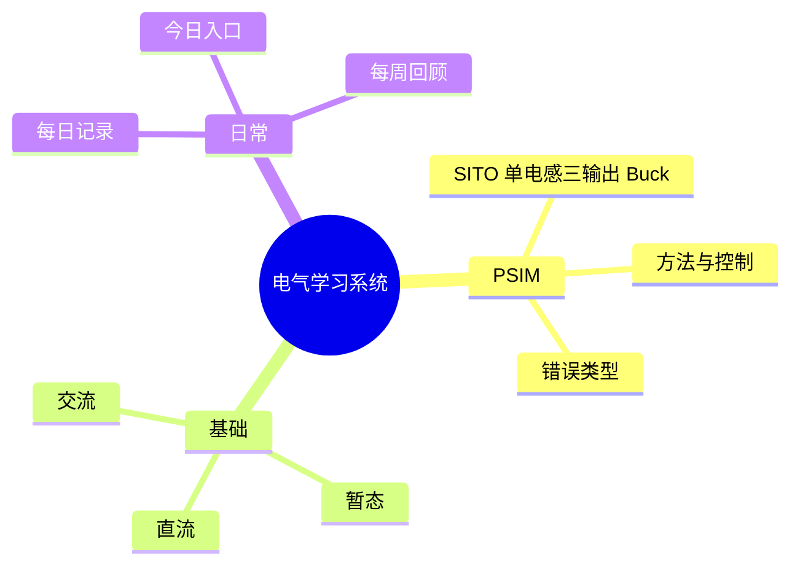

# 电气系统索引

---

## 你当前的学习主线

现在不再把你默认成“只适合走项目主线”的状态。

更准确的判断是：你当前应同时维护两条主线。

1. **系统课主线**
   - 用电路基础课、课程视频和课后复盘补知识骨架
2. **项目主线**
   - 用 `PSIM` / `SITO` 项目沉淀方法、错误类型和经验

默认入口：

- 系统课：`[[10_电气/快速开始|电气快速开始]]`
- 项目线：`[[10_电气/PSIM/00_PSIM索引|PSIM 学习索引]]`

---

## 当前结构

```text
10_电气/
├── PSIM/                 - 当前主战场：项目、方法、错误类型
├── 基础/                 - 理论与课程型笔记
├── 每日记录/             - 每天的工作记录
├── 元信息/               - 导航、索引、模板
└── 快速开始.md
```

补充说明：

- 旧的 `项目/`、`错题/` 已从主学习流中移出
- 以后新的 `PSIM` 内容统一放到 `PSIM/` 下，不再四处分散

---

## PSIM 资产

### 项目层

- `[[10_电气/PSIM/SITO-单电感三输出Buck/01_闭环复现复盘|SITO 闭环复现总览]]`
- `[[10_电气/PSIM/SITO-单电感三输出Buck/02_经验总结|SITO 经验总结]]`
- `[[10_电气/PSIM/SITO-单电感三输出Buck/03_控制链路与PWM逻辑]]`
- `[[10_电气/PSIM/SITO-单电感三输出Buck/04_关键问题与名词澄清]]`
- `[[10_电气/PSIM/SITO-单电感三输出Buck/05_软启动与启动现象]]`

### 方法层

- `[[10_电气/PSIM/方法与控制/PI控制器参数解析]]`
- `[[10_电气/PSIM/方法与控制/三分钟排错剧本]]`

### 错误类型层

- `[[10_电气/PSIM/错误类型/E1-参考点-多点接地]]`
- `[[10_电气/PSIM/错误类型/E2-浮地-MOSFET驱动]]`
- `[[10_电气/PSIM/错误类型/E3-限幅-运放饱和]]`
- `[[10_电气/PSIM/错误类型/E4-时序-PWM死区]]`

---

## 基础区怎么用

当前 `基础/` 开始承接系统课主线，但仍然不建议一上来就写成长篇教材式笔记。

- `10_电气/基础/交流/`
- `10_电气/基础/直流/`
- `10_电气/基础/暂态/`

当前已沉淀：

- `[[10_电气/基础/直流/电路基础课 p01-p03 复盘|电路基础课 p01-p03 复盘]]`

判断依据：

- 项目经验是真实资产，不能推倒
- 但系统课内容需要一个稳定落点，否则会一直停在“听过但没骨架”
- 所以后续更适合：先把课程复盘落到 `每日记录/`，再把稳定内容沉到 `基础/`

---

## 推荐使用顺序

### 如果今天在学系统课

1. 先看 `[[10_电气/快速开始]]`
2. 课后按“回忆 → 重构 → 单点验证 → 单卡沉淀”跑一遍
3. 先写进 `[[10_电气/每日记录/今日]]`
4. 内容稳定后，再沉到 `基础/`

### 如果今天在做项目

1. 先看 `[[10_电气/PSIM/00_PSIM索引]]`
2. 做项目时，优先写进 `SITO-单电感三输出Buck/`
3. 提炼出通用方法时，移到 `PSIM/方法与控制/`
4. 踩到可复现的坑时，移到 `PSIM/错误类型/`

---

## 统计

### 错误类型统计

```dataview
table length(rows) as 数量
from "10_电气/PSIM/错误类型"
where type = "mistake"
group by error_type
sort length(rows) desc
```

### PSIM 文件总览

```dataview
table file.folder as 文件夹
from "10_电气/PSIM"
sort file.name asc
```

---

## 知识图谱



---

## 相关入口

- `[[10_电气/快速开始|电气快速开始]]`
- `[[10_电气/元信息/今日入口|今日入口]]`
- `[[10_电气/元信息/快速开始|使用说明]]`
- `[[10_电气/PSIM/00_PSIM索引|PSIM 学习索引]]`
